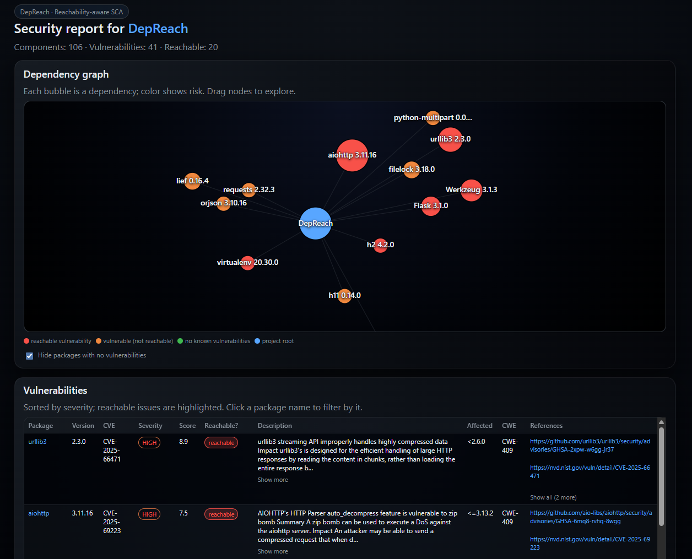

<p align="center">
  <strong>DepReach</strong>
</p>
<p align="center">
  <em>SCA with reachability — find out if vulnerable code is actually reachable.</em>
</p>

<p align="center">
  <a href="LICENSE"></a>
  
  
  
  
</p>

## What is DepReach?

**DepReach** is a [Software Composition Analysis](https://owasp.org/www-project-software-composition-analysis/) (SCA) tool that goes beyond listing CVEs: it tells you whether vulnerable code is **reachable** from your project. It builds call graphs, maps fixes from GitHub diffs to affected functions, and marks issues as reachable or not — so you can prioritize what actually matters.

## Preview



## Features

| Feature | Description |
|--------|-------------|
| **SBOM** | CycloneDX via cyclonedx-py (Python) or cdxgen (Docker) |
| **Vulnerability lookup** | Local VDB (e.g. appthreat-vulnerability-db) |
| **Reachability** | Call graph + AST + GitHub diff → which vuln code is reachable |
| **Caching** | SQLite cache for reachability results |
| **HTML report** | Interactive dependency graph, filter by package, zoom, “hide clean” |

## Requirements

- **Python** 3.10+
- **Docker** (optional) — only if using cdxgen for SBOM
- **Git** — for reachability (GitHub diffs)

## Quick start

```bash
git clone https://github.com/your-org/DepReach.git
cd DepReach
python -m venv .venv
.venv\Scripts\activate   # Windows
# source .venv/bin/activate  # Linux/macOS
pip install -r requirements.txt

python depreach.py -i path/to/your/project -o report.json --cache
```

Reports are written to `reports/<project_name>/` (JSON, SBOM, and HTML)

## Usage

```bash
python depreach.py -i <input_dir> -o report.json [options]
```

| Option | Description |
|--------|-------------|
| `-i`, `--input` | Source code directory (required) |
| `-o`, `--output` | Report filename; output dir is `reports/<project_name>/` |
| `--skip-update` | Skip VDB update |
| `--cache` | Cache reachability in SQLite |
| `-j`, `--jobs` | Parallel jobs for reachability (default: 6) |

**Example**

```bash
python depreach.py -i ./my-app -o report.json --cache
```

## Output

| Artifact | Path | Description |
|----------|------|-------------|
| JSON report | `reports/<name>/report.json` | Vulns with CVE, severity, description, references, reachability |
| SBOM | `reports/<name>/<name>_sbom.json` | CycloneDX SBOM |
| HTML report | `reports/<name>/report.html` | Interactive graph, filter by package, zoom |
| Console | — | Rich table with reachability status |
| Log | `depreach.log` | Debug log |

